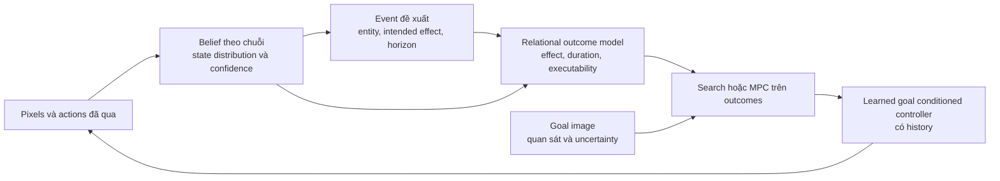

Bản điều tra: tính công bằng của tuning, nguyên nhân kiến trúc và hướng tiếp theo của Event WM

Ngày 11/10/2026, giờ Việt Nam. Phạm vi: rà code hiện tại, ledger, file kết quả đã có và tài liệu gốc. Không sửa code phương pháp, không nộp job, không huấn luyện hay chạy simulator mới trong lượt điều tra này. Những phát hiện về dataflow dưới đây đã được kiểm tra trong source; mức đóng góp của từng vấn đề vào success rate chưa được đo bằng ablation mới.

**Kết luận đề xuất:** tuning theo môi trường và thiết kế rule đều có thể là thành phần hợp lệ của paper. Vấn đề hiện tại không phải phương pháp chưa “fully learned”, mà là các giao diện đang biến quan sát thiếu/chậm thành trạng thái chắc chắn, cùng với việc planner dự đoán hiệu ứng lý tưởng mà bộ điều khiển chưa thực hiện được. Giữ factored event WM, cấu trúc hiệu ứng thưa và search; thay lớp observation/belief/event inference bằng mô hình học theo chuỗi, rồi gắn transition với khả năng thực thi của policy.

**Tuning và lựa chọn rule được đánh giá thế nào.**

| Lựa chọn | Có thể fair cho paper? | Cách trình bày và kiểm chứng phù hợp |
|---|---|---|
| Learning rate, expectile, timeout, planner weight riêng cho mỗi môi trường | Có | Chọn bằng development data/episodes; công khai giá trị, cách chọn và ngân sách tuning; chốt trước final evaluation |
| Cùng một thủ tục lấy percentile/scale từ dữ liệu mỗi môi trường | Có | Nêu cả thủ tục lẫn percentile; “data-derived” vẫn chứa lựa chọn của người thiết kế |
| Object factorization, persistence, sparse effects, relative geometry, A* | Có | Đây là inductive biases/algorithms; mô tả giả định và ablation phần đóng góp |
| Rule mới sau khi xem failure | Có, như một lựa chọn kiến trúc | Các episode đã xem trở thành development; không tiếp tục dùng làm bằng chứng độc lập cho lựa chọn đó |
| Rule riêng cho loại sensor/object | Có thể | Nêu rõ phạm vi; so sánh với baseline có đầu vào và kiến thức tương đương |
| Logic dùng evaluation task ID, đáp án, luật Lights Out/lock/stack cho sẵn | Là một setting khác nếu có | Phải công khai kiến thức được cung cấp; không gọi luật đó là được học từ play |
| Dùng simulator truth để debug | Không tự chứng minh leakage | Tách debug correctness, chọn thiết kế bằng privileged validation, labels dùng train và state dùng runtime |
| Chọn ngưỡng bằng privileged validation accuracy | Có thể, nhưng là development supervision | Nêu rõ nguồn thông tin này; không chỉ nói “không dùng labels” mà bỏ qua cách chọn phương pháp |
| Chọn biến thể tốt nhất trên final test rồi báo cùng test | Có selection bias | Đổi các lượt đó thành development và đánh giá cấu hình cố định trên dữ liệu chưa dùng để chọn |

OGBench cho phép tuning policy-extraction hyperparameters theo nhóm dữ liệu và nhấn mạnh tuning effort tương đương giữa các phương pháp. Một bộ tham số toàn cục là claim mạnh hơn về khả năng chuyển recipe, không phải điều kiện bắt buộc để một so sánh benchmark hợp lệ. [OGBench, §8.1 và §E.4](https://arxiv.org/html/2410.20092v2#A5.SS4).

Tuning cũng có thể overfit seed; cần tách tuning seeds và testing seeds. Việc chọn rule hoặc kiến trúc trên cùng tập hữu hạn có cùng bản chất selection bias như chọn hyperparameter. [Eimer et al., ICML 2023](https://proceedings.mlr.press/v202/eimer23a.html), [Cawley & Talbot, JMLR 2010](https://jmlr.org/papers/v11/cawley10a.html).

Phân biệt ba claim: (a) benchmark performance khi train/tune riêng từng môi trường; (b) recipe transfer khi kiến trúc, rules và thủ tục chọn tham số được chốt trước một môi trường chưa dùng để phát triển, nhưng weights có thể train lại trên play của môi trường đó; (c) weight transfer khi dùng chính weights đã học ở môi trường khác. Fresh episode seeds trên năm goal chuẩn chỉ kiểm tra thêm in-distribution episodes, không tự chứng minh unseen-goal hoặc unseen-environment transfer.

**Bằng chứng hiện có cần được gắn đúng phạm vi.**

- Puzzle 4×5: 13/30 với learned image-goal GCIVL, so với flat 6/30 dùng cùng actor và công thức reset seed. Đây là control tốt để đo lợi ích thêm tầng cao. Tuy nhiên tầng cao có thêm training data/models/search; actor dùng 500 episode, high level dùng 1000, evaluation wall time khoảng 18.9 phút so với 1.9 phút. Không phải so sánh tổng compute/data bằng nhau. [Method output](/E:/jepa-data/event_wm/scene_memory_v2/puzzle_grow_20261008095020/method_pl/obj_loop_gcivl_g12bpairg_seed0/closed_loop.json), [flat output](/E:/jepa-data/event_wm/scene_memory_v2/puzzle_grow_20261008095020/method_pl/gcivl_flat_seed0/gcivl_eval.json).
- Các kết quả oracle/scripted là diagnostic controls; chúng thay đổi cả hành vi robot và visibility, nên không phải upper bound toán học của method. Cube c12 đạt 23/30 với oracle; kết quả đó không thể thay thế learned closed-loop. [Cube diagnostic](/E:/jepa-data/event_wm/scene_memory_v2/cube_grow_20261008093456/method_pl/obj_loop_oracle_c12_seed0/closed_loop.json).
- 3×3/4×4 đã được dùng để sửa perception/rules và đã được reclassify DEV trong V2_PLAN. Bảng STATUS cũ còn gọi held-out là không nhất quán với việc phát triển thực tế. [V2_PLAN](/E:/code-project/jepa-research/event_wm_20261003/method/V2_PLAN.md:47).
- Training RNG của GCIVL hiện hard-code 0. Đổi evaluator --seed chỉ thay episode RNG; chưa tạo independent training seeds. [gcivl.py](/E:/code-project/jepa-research/event_wm_20261003/method/gcivl.py:189).
- PROTOCOL.md, CONSTANTS.md và công cụ freeze/firewall được nêu trong V2_PLAN chưa có ở source hiện tại. Không mô tả những kế hoạch đó như cơ chế đã triển khai và được verify.

**Rà code tìm thấy các vấn đề cấu trúc sau.**

| Phát hiện đã xác minh | Hệ quả dự kiến; chưa lượng hóa bằng run mới | Source |
|---|---|---|
| before_known=False nhưng before vẫn chứa giá trị rest cũ; WM không nhận before_known | Trạng thái thiếu được dùng như conditioning state chắc chắn | [events_objects.py:513](/E:/code-project/jepa-research/event_wm_20261003/method/events_objects.py:513), [world_model.py:939](/E:/code-project/jepa-research/event_wm_20261003/method/world_model.py:939) |
| Gate label là after−before, mask loss chỉ bằng after_known | Before thiếu có thể tạo change/unchanged target sai | [world_model.py:949](/E:/code-project/jepa-research/event_wm_20261003/method/world_model.py:949) |
| Chỉ giữ event có acted entity known cả trước lẫn sau | Censoring có hệ thống theo visibility; các nhấn dưới tay bị thiếu trong training | [world_model.py:885](/E:/code-project/jepa-research/event_wm_20261003/method/world_model.py:885), [events_objects.py:575](/E:/code-project/jepa-research/event_wm_20261003/method/events_objects.py:575) |
| SeeThrough gán tập {before, after} cho covered visit có thay đổi; loss nhận cả hai | Dự đoán old state sau tương tác vẫn có loss tốt; không có ràng buộc thời điểm chuyển | [frontend.py:299](/E:/code-project/jepa-research/event_wm_20261003/method/frontend.py:299), [frontend_train.py:416](/E:/code-project/jepa-research/event_wm_20261003/method/frontend_train.py:416) |
| Event grouping dựa vào cửa sổ thay đổi nhìn thấy; effector chọn acted entity trong timeline đó | Clock của tương tác còn phụ thuộc delay của sensor, đặc biệt qua occlusion | [events_objects.py:398](/E:/code-project/jepa-research/event_wm_20261003/method/events_objects.py:398) |
| State-goal GCIVL backfill initial unknown bằng first future-valid reading | Current-policy features lúc train có thông tin mà deployment chưa có | [gcivl.py:126](/E:/code-project/jepa-research/event_wm_20261003/method/gcivl.py:126) |
| labels_train rest/covered labels có aggregation theo cả khoảng thời gian | Phù hợp làm smoothed targets; chưa phù hợp làm causal belief input mà không replay filter | [events_objects.py:357](/E:/code-project/jepa-research/event_wm_20261003/method/events_objects.py:357) |
| Pairg cố ý chỉ nhìn acted entity, entity được dự đoán và target | Thiếu context nhiều vật/precondition dạng tồn tại, dù tốt cho sparse puzzle effects | [world_model.py:130](/E:/code-project/jepa-research/event_wm_20261003/method/world_model.py:130) |
| Support dùng NCE context corruptions, không dùng verified failures | Score đo khác biệt với distribution của play; chưa phải xác suất thực thi hay luật vật lý | [event_support.py:1](/E:/code-project/jepa-research/event_wm_20261003/method/event_support.py:1), [train_support.py:2](/E:/code-project/jepa-research/event_wm_20261003/method/train_support.py:2) |

Lỗi causal features ở state-goal không trực tiếp ảnh hưởng số 43% image-goal. Số 0/30 state-goal hiện tại chưa đủ để kết luận state/latent goals không hiệu quả: implementation còn train/deploy mismatch và goal representation đang yêu cầu khớp cả những thuộc tính không chắc chắn.

Predictability observational cũng không tự chứng minh một thuộc tính vô nghĩa với task. Bỏ appearance khỏi goal/prediction tests bằng ngưỡng R² có thể là approximation hữu ích, nhưng không phải một bảo đảm về state sufficiency. Đề xuất học latent factor/observation model để nhiều dấu hiệu ảnh cùng phản ánh một biến thế giới, thay vì xóa chiều goal theo threshold sau failure.

**Vì sao 3×3 chưa thể coi là “chỉ cần search dễ hơn”.**

3×3 có không gian tìm kiếm nhỏ hơn nhưng tay robot che tỷ lệ bàn lớn hơn. 9/9 object được discover không bảo đảm state được đọc đúng quanh từng interaction. Ledger ghi centre after-state unknown khoảng 70% ở một bản events; continuity fill điền 0 vì che kéo dài qua nhiều event. Kiểm tra sau ghi neighbour changes của centre chỉ hiện ra với tỷ lệ .45–.66, và true cross của centre được WM dự đoán đúng khoảng .10. [Ledger](/E:/code-project/jepa-research/event_wm_20261003/JOB_LEDGER.md:2023), [kiểm tra sau](/E:/code-project/jepa-research/event_wm_20261003/JOB_LEDGER.md:2174).

Run scripted mới nhất tìm first plan ở 100% episodes nhưng chỉ thành công 1/30. Đây là bằng chứng mạnh rằng “tìm được plan trong model” và “plan đúng trong simulator” đang tách rời. Event-exact khoảng .504 của WM được chấm với inferred event labels, không phải tất cả transition truth. [Run](/E:/jepa-data/event_wm/scene_memory_v2/heldout_puzzle3x3/method_pl/obj_loop_scripted_c10_seed0/closed_loop.json), [WM evaluation](/E:/jepa-data/event_wm/scene_memory_v2/heldout_puzzle3x3/method_pl/obj_model_g12dpairg/wm_eval.json).

Các hạn chế khác cũng cần tách: benchmark chuẩn dùng horizon 500 cho 3×3/4×4 và 1000 cho 4×5/4×6; dataset chuẩn 4×5 lớn hơn. Chúng không giải thích hết failure gần tuyệt đối với scripted arm, nhưng so sánh độ khó tổng thể phải nêu chúng. Root cause cuối của từng stale neighbour vẫn chưa được resolve; audit này không coi SeeThrough là nguyên nhân duy nhất.

**Đối chiếu nghiên cứu gốc và lựa chọn kiến trúc.**

| Nguồn | Ý tưởng dùng được | Giới hạn khi áp dụng ở đây |
|---|---|---|
| [PlaNet](https://planetrl.github.io/) | Encode history thành recurrent latent belief, fusion prediction/observation | Là online MBRL; không cung cấp trực tiếp offline event abstraction |
| [BISCUIT](https://proceedings.mlr.press/v216/lippe23a/lippe23a.pdf) | Action/regime-conditioned sparse interaction bottleneck | Theorem giả định observation injective và binary/distinct mechanisms; occlusion không thỏa injectivity. Không phải chứng minh closed-loop OGBench |
| [THICK](https://proceedings.iclr.cc/paper_files/paper/2024/file/13b45b44e26c353c64cba9529bf4724f-Paper-Conference.pdf) | Sparse recurrent updates, learned context changes và variable-duration transitions | Có reward/online hoặc exploration-data settings; chưa chứng minh recipe này trên offline pixel OGBench |
| [H-JEPA, 05/10/2026](https://arxiv.org/html/2610.06805v1) | Learned hierarchy với latent space khác nhau theo timescale | Có single-cube grasp-centered evaluation, không đồng protocol multi-cube/scene/puzzle hiện tại. Generic learned hierarchical JEPA đã là prior art gần |
| [WorldDP](https://arxiv.org/html/2606.08775v1) | Object WM chọn subgoal, learned controller thực hiện | Có DINOv2/SAM2 và thêm thiết kế/input; camera/metrics khác. Không dùng số paper đó như baseline chuẩn trực tiếp |
| [STRIPS-WM](https://arxiv.org/html/2606.06832v1) | Học predicates/operators và preconditions | Có thư viện high-level executable action IDs và trusted missing pairs; ở đây cần học chính abstraction/skills từ primitive actions |
| [Jumpy World Models, ICML 2026](https://proceedings.mlr.press/v306/farebrother26a.html) | Predict multi-step occupancies dưới policy cụ thể bằng off-policy learning | Cần pretrained policies và state/model assumptions; recurrent pixel-belief version là phần phải xây và kiểm chứng thêm |

Các nguồn trên hỗ trợ hướng thiết kế, không chứng minh phiên bản đề xuất chắc chắn thắng. Không nên đặt novelty chỉ ở “hierarchy học hoàn toàn”, “object WM + controller”, hay “binary interaction gates”: những thành phần đó đã có prior art gần.

| Phương án | Lợi ích | Rủi ro | Đề xuất |
|---|---|---|---|
| Tiếp tục thêm rule/threshold vào pipeline hiện tại | Có thể cải thiện nhanh một số failure | Decision cứng và dependence giữa sensor/event/planner tiếp tục tích tụ | Giữ làm reference; sửa correctness, hạn chế thêm logic chữa riêng một failure |
| Học recurrent belief + event/outcome, giữ object scaffold và search | Nhắm trúng uncertainty, alignment và executor gap; tận dụng phần đã tốt | Cần sequence training và kiểm soát model exploitation | Chọn làm hướng chính tiếp theo |
| Thay toàn bộ bằng slots/latent hierarchy end-to-end | Bỏ được nhiều object/event rules | Học discovery, identity, dynamics, timing và controller cùng lúc; gần prior art; small task-critical bits có thể bị bỏ | Một baseline/nhánh đối chứng sau, không phải rewrite đầu tiên |

**Kiến trúc cụ thể đề xuất.**

1. **Observation khác belief khác target.** Dùng raw image/learned features và history để đưa ra likelihood cho từng entity; giữ object discovery hiện có như proposal bootstrap. Belief cập nhật từ prior theo actions cộng bằng chứng ảnh. Truyền validity/confidence xuyên WM, support và policy. Chưa nhìn thấy không có nghĩa là unchanged, ở goal, hoặc hidden theo nghĩa vật lý.

2. **Tách physical state và visibility.** Arm occlusion, object bị vật khác che và object không tồn tại/không được track là các trường hợp khác nhau. Không ép tất cả về một covered bit rồi dùng làm truth trong planning. Goal image cũng có uncertainty; nếu hai goal states thật sự tạo cùng ảnh thì không thể hứa phân biệt chúng bằng học tốt hơn. Active inspection chỉ giúp current state, không làm xuất hiện thông tin không có trong goal image.

3. **Causal filter lúc train và deployment phải cùng input.** Replay online reader/filter để tạo current-policy features. Có thể dùng future observations trong offline smoother để tạo posterior/goal/outcome targets; distill sang causal filter theo phân phối và confidence. Không backfill tương lai vào current features. Khi trước/sau không chắc, marginalize hoặc train sequence likelihood; không tạo binary change label từ stale endpoints.

4. **Học event và duration từ chuỗi pixels/actions.** Dùng action/effector evidence để suy ra interaction latent và soft temporal boundary; old change windows chỉ làm weak proposals khởi tạo. Posterior train có thể nhìn outcome tương lai, prior online chỉ nhìn quá khứ. Sparse update prior khuyến khích persistence; sequence/multi-step consistency và reappearance constraints buộc effect thích hợp với những frame về sau. Không chỉ self-distill nhãn cũ vốn đã thiếu centre effects.

5. **Giữ sparse relational effects, thêm context aggregation nhỏ.** Pairg vẫn là backbone hợp lý cho hiệu ứng cục bộ. Thêm attention/set aggregation cho điều kiện nhiều entity, ví dụ relation tồn tại vật đỡ hoặc trạng thái container. Các relation phải học từ play, không viết luật “mở drawer trước”, “centre toggles cross” vào method.

6. **Planner phải biết controller làm được gì.** Model hóa multi-step outcomes dưới learned executor, có duration/cost và uncertainty, thay vì chỉ f(state, intended target) lý tưởng. NCE giữ vai trò offline support; không gọi sigmoid của nó là physical feasibility probability. Có thể bắt đầu với policy-conditioned reachability/value hoặc multi-step model, rồi mở rộng distribution của outcomes. Đây là nơi mượn nguyên lý policy-conditioned jumpy dynamics.

7. **Giữ setting offline thật.** Dataset play không có nhãn intention: một đoạn no-change không tự chứng minh một intended manipulation thất bại. Dùng hindsight goals, Bellman/off-policy learning và observed action-conditioned outcomes; giữ uncertainty ở vùng thiếu coverage. Nếu lấy rollout của policy hiện tại để cập nhật model/policy thì đó là online adaptation, phải báo riêng; evaluation rollout không lặng lẽ trở thành training data.

8. **Goal interface cho executor là latent/state có mask và confidence.** Truyền intended change hoặc event latent cùng history; không bắt khớp full vector chứa fabricated hidden state. Bỏ image compositing khỏi interface mặc định sau khi causal state interface chạy đúng; giữ image-goal GCIVL làm control. Chưa đổi sang diffusion chỉ vì WorldDP dùng nó: hiện bằng chứng mạnh hơn chỉ vào state/timing/control interface, chưa chỉ vào policy head.

9. **Search giữ được, nhưng không hứa A* optimality trên belief.** Ban đầu dùng bounded search/receding-horizon trên vài outcome hypotheses hoặc mean-plus-uncertainty với ablation; update sau execution. Nêu rõ approximation, tránh đổi sensor uncertainty thành symbolic certainty. Chi phí tính theo số bước/thời gian và khả năng thực thi, vì event count thấp không bảo đảm đủ environment horizon.

**Thứ tự triển khai đề xuất, đi xuyên đến closed loop.**

- Đầu tiên sửa interface correctness: causal current-state replay, before-known/confidence input, mask change loss khi endpoints chưa biết, training seed thật. Giữ checkpoint/config cũ làm reference, không overwrite artifact của phiên khác. Không cần dựng một loạt novelty/headroom gates trước các sửa này.
- Xây một vertical slice recurrent observation/belief → learned sparse event updates → WM/search → learned controller trên 3×3 và 4×5 cùng code; chạy closed-loop đồng thời với diagnostic oracle/scripted arm trong cùng protocol. 3×3 kiểm tra occlusion/alignment; 4×5 kiểm tra giữ được lợi ích compositional planning. Diagnostic state/transition variants chỉ dùng để phân bổ lỗi, không train method bằng truth.
- Đưa cùng module sang cube/scene, thêm relational context cho applicability và controller-conditioned horizon/outcomes. Giữ continuous state cho mover/slides, categorical uncertainty cho modes; không thêm rule theo task ID.
- Đối chứng cần thiết: current hybrid; recurrent belief với event rules cũ; recurrent belief với learned events; flat recurrent GC policy cùng representation; sparse pair effects với/không context aggregation. Các contrast này đo memory, abstraction và context, không phải một speculative sweep.
- H-JEPA/latent hierarchy là baseline gần cần xét cho claim mới; chạy khi version/setting có thể match, hoặc công khai phần protocol khác. Với ngân sách hữu hạn, ưu tiên control trả lời giả thuyết cụ thể hơn là tái hiện tất cả paper trong bảng.

Lượt đầu tiên nên trả về actual learned closed-loop success, event/outcome calibration, failure breakdown và compute; không dừng ở đẹp reconstruction hoặc offline event accuracy. Nếu metric yếu, chẩn đoán dựa trên disagreement trong chính run để sửa bounded iteration.

**Protocol cho kết quả paper.**

1. Dữ liệu/episode đã xem đều là development. Cho phép tuning riêng môi trường bằng một danh sách tham số nhỏ và ngân sách công khai. Ghi nguồn chọn: raw play, development success, hay privileged diagnostic.
2. Tạo independent training seeds thay vì chỉ đổi reset seeds. Một protocol giảm compute thực dụng là 3 training seeds × 20 fresh rollouts × 5 goals cho mỗi môi trường; báo rõ dưới ngân sách benchmark gốc. Dùng cùng episode list giữa phương pháp để so sánh paired.
3. Chốt training budget và checkpoint rule trước final test. Có thể báo final checkpoint cố định; không gọi nó là tái hiện chính xác protocol published nếu paper gốc average nhiều checkpoint. Báo uncertainty qua training seeds và episode outcomes; không xem mọi rollout cùng checkpoint như independent model runs.
4. Flat GCIVL cùng subset/budget là attribution control. Baseline strongest phù hợp như HIQL trên small puzzles cũng cần được xét; công khai extra WM/frontend training và planner inference. Published numbers chỉ là tham chiếu khi data/compute/checkpoints chưa match.
5. Với recipe transfer, chốt code/rules và thủ tục fit tham số trước các môi trường chưa phát triển, ví dụ 4×6/cube-double/quadruple nếu kiểm tra lịch sử xác nhận chúng chưa dùng để chọn. Retrain weights từ play theo recipe chốt vẫn là recipe transfer, không zero-shot weight transfer.
6. Keep offline scores, privileged diagnostics và learned closed-loop success thành kết quả riêng. Final evaluation không cập nhật training artifacts.

Mọi run tương lai phải tuân thủ compute rules của workspace: không physics/model loading/bulk analysis trên Slurm login; explicit sbatch resources/time và kiểm tra quota trước GPU submissions/CPU arrays khi dùng cluster; verify squeue và sacct; kiểm tra peer jobs trước nộp. Bản điều tra này chưa đưa ra compute headroom hay chấp thuận submission vì chưa có kiểm tra ranking/job state mới.

**Claim paper đáng theo đuổi nếu thực nghiệm xác nhận:** learned event beliefs và controller-grounded composition từ offline robot play pixels, có thể giữ state qua occlusion và lập kế hoạch trên kết quả thực thi có uncertainty. Đây là hướng giả thuyết sau audit, chưa là contribution đã chứng minh. Tính công bằng không đòi “không có rule”; chất lượng paper cần cơ chế rõ, kết quả độc lập, control hợp lý và lợi ích vượt chi phí/giả định bổ sung.
