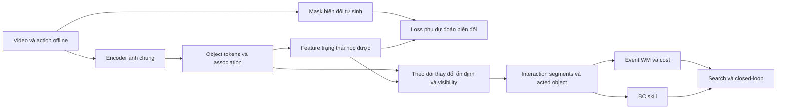

# Frontend ảnh chung: đánh giá EAWM và hướng áp dụng

Ngày 06/10/2026. Đây là tổng hợp tài liệu và kiểm tra source; chưa có thử nghiệm frontend mới. Các nhận định về OGBench dưới đây là giả thuyết cần đánh giá bằng closed-loop.

## Kết luận

EAWM là related work trực tiếp, nhưng chưa cung cấp toàn bộ frontend cần cho method hiện tại. Tôi ưu tiên học object token nhất quán qua thời gian, rồi dùng tín hiệu biến đổi để giữ thông tin trạng thái và xác định tương tác. Không nên đổi toàn bộ method sang online Dreamer chỉ vì paper có chữ event.

[EAWM, ICLR 2026](https://proceedings.iclr.cc/paper_files/paper/2026/file/fc09b26b85ab3abb2832bd555a2e4215-Paper-Conference.pdf) thêm mục tiêu dự đoán event và tái tạo observation có trọng số. Thực nghiệm là online RL; chưa đánh giá offline OGBench. Đây là prior art cho học representation qua event, không phải bằng chứng pipeline manipulation của mình đã được giải quyết. Đã đọc Sections 2–3, Figure 3, Algorithm 1 và phần limitations.

## Những gì đã kiểm tra trong code chính thức

Source được giữ tại commit `49eebbe4c120bd926ae3a0760642fab89f3fb5bf`; manifest có SHA256 và bản license. Chỉ đọc source, không import hoặc chạy code bên ngoài.

- [EADream/tools.py](https://github.com/MarquisDarwin/EAWM/blob/49eebbe4c120bd926ae3a0760642fab89f3fb5bf/EADream/tools.py#L152): tạo mask biến đổi bằng OpenCV MOG2, cập nhật theo từng frame, rồi morphology closing. Đây là thuật toán chung, không phải nhãn cube/button.
- [EADream/models.py](https://github.com/MarquisDarwin/EAWM/blob/49eebbe4c120bd926ae3a0760642fab89f3fb5bf/EADream/models.py#L271): đếm pixel có event; khi mật độ quá cao thì tắt event loss. Dynamics vẫn nhận chuỗi action theo timestep. Không thấy cơ chế tạo macro-action rest-to-rest hoặc gán object được tác động.
- [EASimulus/world_model.py](https://github.com/MarquisDarwin/EAWM/blob/49eebbe4c120bd926ae3a0760642fab89f3fb5bf/EASimulus/src/models/world_model.py#L72): có hàm trọng số liên tục theo mật độ event; phần loss dùng trọng số đó. Hai implementation không dùng cùng một hàm gate, vì vậy không nên mô tả GES như một network học ranh giới event.

Suy luận từ cấu trúc code: mask biến đổi không tự cho biết object identity, object nào bị robot tác động, hay endpoint ổn định để làm mục tiêu cho skill. Mượn event loss có thể hữu ích; coi mask đó là một interaction segment hoàn chỉnh thì không có cơ sở.

## Khoảng cách của frontend hiện tại

Kiểm tra source frozen của `unified_rerun_20261006` cho thấy:

| Thành phần | Hiện tại | Vấn đề cần giải quyết |
|---|---|---|
| Object proposals | SAM2 + point grid + lọc mask | Có thể chia nhỏ một object hoặc bỏ object nhỏ; cần đo trên ảnh 64×64 của mình |
| Identity | Tracking và inventory được discover trước; reader có output theo identity cố định | Cần association ổn định giữa các frame và giữa observation với goal |
| Trạng thái | Tâm mask, RGB trung bình, covered | Quá hạn chế cho chiều sâu, góc quay, trạng thái fixture và occlusion |
| Event | Thay đổi position/appearance giữa hai khoảng rest; nhóm các cửa sổ thay đổi chồng nhau | Chất lượng phụ thuộc reader; nhiễu/che khuất có thể tạo hoặc gộp sai event |
| Phân biệt agent | Probe SAM2 dùng tần suất chuyển động | Một object được di chuyển nhiều có thể bị nhầm là agent; đây là rủi ro từ quy tắc, chưa phải chẩn đoán định lượng mới |
| Backend | `D=6`, identity embedding theo K; h flatten K object; skill embedding theo K | Một encoder latent mới không cắm trực tiếp vào model cũ; phải cập nhật interface và train lại |

Các file liên quan là `sam2_entities.py`, `u_reader_entities.py`, `u_events.py`, `u_wm.py`, `u_skill.py`. Các file này chỉ được đọc; source/config đang chạy không bị sửa.

## Hướng frontend phù hợp hơn

[SlotContrast](https://arxiv.org/abs/2412.14295) học object representation từ video không nhãn và dùng temporal contrastive loss để tăng tính nhất quán identity. Đây là nguồn tham khảo gần với phần object discovery/tracking hơn EAWM.

[Grounded Correspondence](https://arxiv.org/abs/2605.03650) tách identity association khỏi dynamics: khởi tạo slot từ feature và ghép identity bằng Hungarian matching. Đây là lựa chọn correspondence cần đọc khi triển khai, không phải bằng chứng nó đã hoạt động trên puzzle/scene của mình.

Đề xuất sau đây là thiết kế để thử, không phải kết quả của các paper:

1. Object token phải giữ được identity, vị trí và trạng thái liên quan đến điều khiển. Cùng một object có thể đổi trạng thái mà không đổi identity. Không gán tên semantic cube/button bằng cột simulator.
2. Identity feature và state feature có thể cần hai nhánh. Giữ identity bất biến khi đèn đổi màu là hữu ích, nhưng state feature phải ghi nhận thay đổi ấy. Dùng feature semantic pretrained đơn thuần có nguy cơ bỏ mất điều này.
3. Tín hiệu biến đổi dùng để học state feature và đề xuất thời điểm tương tác. Điểm kết thúc phải kiểm tra trạng thái ổn định, visibility và sự rời đi của agent; ảnh ít thay đổi do bị che không có nghĩa là object đã nghỉ.
4. Acted object cần được phân biệt với side effects bằng lịch sử tương tác/action và quan hệ agent–object. Object đổi nhiều nhất chưa chắc là object được tác động.
5. Có thể giữ SAM2 như nguồn proposal chung trong phiên bản đầu, nhưng thay centroid/RGB bằng feature học được. Phải công khai pretraining bên ngoài; bỏ adapter semantic không đồng nghĩa tự động hết mọi prior.

Các điểm khó cụ thể cần đưa vào demo và đánh giá end-to-end: 20 nút gần giống nhau và state sáng/tắt; cube bị tay che hoặc bị xếp chồng; drawer/window và cube cùng chuyển động. Layout mới phải được held-out; không dựa vào success trên đúng bố trí đã dùng để chỉnh frontend.

## Cách kiểm tra đóng góp mà không tạo một chuỗi gate riêng

Tích hợp frontend đã chọn vào event WM, train skill và chạy closed-loop trên ba family bằng cùng recipe. Ghi mask/identity, feature trước-sau, boundary, acted object và predicted/observed successor ngay trong run. Simulator chỉ dùng cho chẩn đoán và scoring, không làm training label hoặc đầu vào planning.

Đối chứng cần cùng frontend: backend hiện tại so với phiên bản không có event-prediction auxiliary loss để xác định loss ấy có giúp không; thêm baseline theo timestep/subgoal trên cùng feature để kiểm tra lợi ích của temporal abstraction. Match data, input và điều kiện environment; báo cả training và planning compute. Đây là khung so sánh, chưa phải lịch GPU hay một sweep được submit.

Claim tiềm năng là học interaction events có thể thực thi từ offline ảnh, giúp planning dài hạn với continuous control. Không dùng claim “đầu tiên đưa event vào WM” hoặc “frontend không có heuristic”. Tính mới và mức cải thiện vẫn cần đối chiếu thêm prior art và kết quả matched closed-loop.
