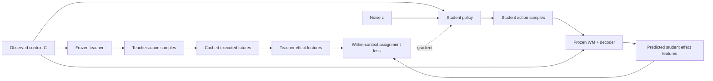

# Một hướng cho CVPR 2027: Outcome-Transport Distillation

Ngày nghiên cứu: 30/09/2026. Trạng thái: **đề xuất method chưa triển khai, chưa có kết quả thực nghiệm**. Các số liệu repo dưới đây lấy từ báo cáo và ledger đã lưu; không phải kết quả một run mới hay xác nhận trạng thái scheduler hiện tại.

## 1. Quyết định nghiên cứu

Tôi chọn **chưng cất policy theo phân bố hậu quả của hành động**, tên làm việc *Outcome-Transport Distillation* (OTD).

Một policy teacher chậm có thể sinh nhiều action chunk. Student nhanh cần giữ được những kết quả vật lý mà teacher có thể tạo ra, dù không tái tạo chính xác từng tọa độ action. Method dùng world model cố định để đưa một loss khớp phân bố hậu quả vào quá trình chưng cất. Khi triển khai, chỉ chạy student từ lịch sử quan sát hiện có.

Lựa chọn này dựa trên tài sản và chi phí đã đo trong repo: teacher diffusion, các nhánh tương lai thực thi từ cùng trạng thái, codec/decoder và world model đều đã có trên PushT. Đây là cách đặt một câu hỏi mới lên pipeline hiện có, thay vì xây thêm một representation rồi lại đi tìm nơi nó có ích.

**Giới hạn quyết định:** repo chưa đo khoảng hụt closed-loop của baseline OneDP mạnh. Vì vậy, ta có bằng chứng về nút thắt latency, nhưng chưa có bằng chứng rằng loss OTD sẽ sửa một lỗi control còn lại. Run đầu tiên phải train và đánh giá OneDP cùng OTD, không được coi một baseline DDIM ít bước yếu là bằng chứng đủ.

Tôi không kết luận proposal này chắc chắn mới hoặc sẽ được accept. Qua những công trình chính thức đã đối chiếu, chưa thấy một bản trùng hoàn toàn với thiết kế hẹp ở đây. Điều đó không thay thế kiểm tra related work khi viết bài và bằng chứng thực nghiệm.

## 2. Những paper đơn giản đã làm đúng điều gì?

Các công trình tham chiếu đều có bản được nhận ở hội nghị chính; CoRL được dùng thêm như hội nghị chuyên ngành robotics. Khi trang proceedings chỉ có abstract hoặc không tải được toàn văn, đọc bản tác giả và dùng proceedings để xác nhận venue. Danh mục nguồn nằm trong [SOURCE_LEDGER.md](/Users/nhatcuong/code_project/vin-research/research_method_20260930/SOURCE_LEDGER.md).

| Paper | Vấn đề → giả thuyết → can thiệp | Điều cần học cho đề xuất này |
|---|---|---|
| [OneDP, ICML 2025](https://proceedings.mlr.press/v267/wang25ba.html) | Denoising chậm → có thể chuyển phân bố policy sang generator một bước → distillation theo KL. | Baseline chính phải là distillation mạnh; tăng tốc so với DP nhiều bước đã có. |
| [WPT, CVPR 2026](https://openaccess.thecvf.com/content/CVPR2026/html/Jiang_WPT_World-to-Policy_Transfer_via_Online_World_Model_Distillation_CVPR_2026_paper.html) | WM làm deployment tốn kém → chuyển kiến thức vào student → query/reward distillation. | WM chỉ dùng lúc train đã có; phải cô lập giá trị của việc khớp phân bố hậu quả. |
| [Sparse Imagination, ICLR 2026](https://proceedings.iclr.cc/paper_files/paper/2026/hash/a750d52284ff70c6d6bab8072c392d74-Abstract-Conference.html) | Dự đoán nhiều visual token tốn compute → sparse prediction giữ đủ thông tin → randomized grouped attention. | Một thay đổi nhỏ có thể đủ khi trade-off quality/compute được đo đúng. |
| [DINO-WM, ICML 2025](https://proceedings.mlr.press/v267/zhou25t.html) | Visual representation ảnh hưởng planning → pretrained spatial features hỗ trợ dynamics → dự đoán patch features. | Representation phải được chứng minh bằng hành vi của planner. |
| [COT Policy, CoRL 2025](https://proceedings.mlr.press/v305/sochopoulos25a.html) | Coupling không xét condition làm few-step flow kém → coupling có điều kiện → OT giữa noise và action. | OT cho policy nhanh đã có; không ghép các context khác nhau và gọi đó là novelty. |

Đây là cách đọc thiết kế và evidence của các paper, **không phải giải thích chắc chắn vì sao reviewer đã accept**. Không thể suy ra quyết định accept từ số layer hay số loss. Các paper cho thấy một cơ chế nhỏ vẫn có thể nâng một đường trade-off quan trọng, miễn là đối chứng đủ mạnh và kết quả thực sự gắn với câu hỏi.

Chuỗi thiết kế phù hợp ở đây là: xác định chi phí deployment → nêu một sai lệch do chưng cất → sửa đúng objective → chứng minh control ở cùng chi phí student. Nếu chỉ có action error, feature error hoặc tốc độ hơn teacher, câu chuyện còn thiếu.

## 3. Repo nói được gì, và chưa nói được gì?

### Nút thắt latency có số đo

[CTA ledger, kết quả 55763](/Users/nhatcuong/code_project/vin-research/trajectory_innovation_20260922/JOB_LEDGER.md:733) ghi CTAV2 scorer khoảng **4,1 ms/decision** ở K=8, G=1, còn policy sampling khoảng **770 ms**. Các timing này thuộc cấu hình đã ghi trong ledger, không phải mức latency chung cho mọi phần cứng hoặc một comparison mới.

Trong cấu hình ấy, loại bỏ cả scorer cũng chỉ tiết kiệm một phần nhỏ thời gian. Nhắm vào generator có tiềm năng thay đổi chi phí deployment lớn hơn. Từ đó chưa suy ra student sẽ giữ được quality; đây là điều phải đo.

### CTA có tín hiệu, nhưng tín hiệu ranking chưa chuyển thành separation đủ mạnh

[Ledger PushT v2](/Users/nhatcuong/code_project/vin-research/trajectory_innovation_20260922/JOB_LEDGER.md:730) ghi trên 200 development roots: P0 122, CTA4 142, CTAV2 140, ENDV2 138, DIRV2 135 và DINO-WM 136 successes. Chênh lệch với các learned baseline vẫn chưa chắc chắn.

Phép so parameter-matched giữ được khoảng cách offline CTA–DIRECT: retained gap 0,680 so với 0,502. Phân tích recovery ghi P0 bỏ lỡ một crossing ở 45 roots nhưng vẫn thành công sau đó ở 33 roots. Điều này giải thích vì sao một lợi thế quyết định thực không tự nhân tuyến tính thành success gain.

OTD vì thế không tiếp tục dựa vào giả định “retained gap cao hơn thì closed-loop sẽ tăng tương ứng”. Nó dùng tài sản CTA như một nguồn supervision khi train một policy deployment khác. Lợi ích riêng của trajectory code vẫn cần đối chứng endpoint.

### Không lấy lỗi baseline đã sửa làm đóng góp mới

[State-estimation ledger](/Users/nhatcuong/code_project/vin-research/state_estimation_20260930/JOB_LEDGER.md:38) ghi Reacher tăng từ 76,7% lên 96,7% sau history prefill. Innovation/MHE không thêm gain đáng kể trên baseline đã sửa. Những sửa này phải đi vào comparison mới nếu sử dụng LeWM; không tái sử dụng baseline thiếu context để tạo separation.

### Khoảng hụt mới vẫn là giả thuyết

Chưa có trong repo một phép so cho thấy: OneDP cùng architecture và compute đánh mất các mode hậu quả quan trọng; OTD giữ được chúng; điều đó cải thiện native closed-loop success. Không nên viết ba mệnh đề này như finding. Một pilot tích hợp train–control sẽ kiểm tra chúng cùng lúc.

## 4. Research hypothesis đủ hẹp

> Với student có năng lực và ngân sách huấn luyện hữu hạn, khớp phân bố hậu quả của action theo từng context có thể giữ chất lượng closed-loop của teacher tốt hơn việc dành cùng ngân sách để khớp phân bố action hoặc scalar reward.

Ví dụ giả định: hai đường đi hơi khác nhau của end-effector có thể tạo cùng một chuyển động object; gần một tiếp xúc, một thay đổi action nhỏ có thể tạo hậu quả khác hẳn. Khoảng cách action đều theo tọa độ không phản ánh những khác biệt này. Đây là động cơ nghiên cứu, chưa phải finding về OneDP trong repo.

Một phản biện toán học phải được thừa nhận: nếu student khớp **chính xác** phân bố action có điều kiện và dynamics giống nhau, phân bố hậu quả cũng khớp. Vì vậy, OTD không cung cấp thông tin mà action distribution đúng hoàn toàn thiếu. Câu hỏi là **phân bổ sai số xấp xỉ hữu hạn** vào những hướng ít ảnh hưởng control hơn.

Method có thể giữ teacher tốt hơn nhưng không tự biến teacher thành policy tối ưu. Nếu teacher có mode xấu, khớp mass của teacher cũng giữ mode xấu. Primary experiment không dùng privileged success để loại chúng rồi gọi gain là distillation tốt hơn.

## 5. Method tối thiểu

### Input, teacher và student

- Context C gồm đúng lịch sử ảnh/proprio hợp lệ trước quyết định. Nếu task có goal input g thì cả teacher và student nhận cùng g; PushT fixed-goal không chứng minh goal generalization.
- Teacher là diffusion policy hiện có, được freeze. Primary run dùng teacher nguyên bản; teacher cộng selector được xem là một setting riêng nếu làm sau.
- Student stochastic A = Gθ(C, g, z) sinh action chunk trong một forward pass, dùng cùng observation encoder, normalization, action horizon và phần action thực thi như baseline distillation.
- Student sinh đủ horizon native. Loss hậu quả chỉ xét phần action sẽ được execute trước lần quan sát/replan tiếp theo; phần đuôi vẫn được objective gốc ràng buộc.

### Các mẫu phải xuất phát từ cùng một context

Ở mỗi context, lấy M=4 action chunks teacher và M=4 action chunks student. Teacher samples phải thực sự là samples của teacher đã định nghĩa, có metadata phiên bản và seed; không được lấy một tập đã chọn theo oracle mà mô tả là phân bố policy nguyên bản.

Teacher futures là các nhánh đã thực thi từ bản clone cùng trạng thái, có thể tái sử dụng sibling caches trong repo. Không ghép teacher của trạng thái này với student của trạng thái gần nó trong batch. Khởi đầu giữ mass đồng đều giữa các samples, không dùng một reward weighting mới.

### Không gian hậu quả

Primary PushT implementation dùng thay đổi visual features ở các bước 2, 4, 6 và endpoint 8, cùng representation/normalization cho teacher và student:

- Φᵀ: features của **tương lai thực thi teacher đã cache**, trừ features hiện tại; stop-gradient.
- Φˢ: features tương lai dự đoán từ **WM và decoder đã freeze**, trừ features hiện tại.
- Student action đi qua action-conditioned WM để dự đoán code S; decoder nhận C và S để tái tạo visual future features. Decoder không đọc trực tiếp action.

Khoảng cách d là tổng các feature distances đã chuẩn hóa, với mỗi thời điểm có trọng số bằng nhau ở bản đầu. Endpoint 16×16 và intermediate 8×8 phải được chuẩn hóa riêng theo số token để endpoint không lấn át chỉ vì nhiều patch. Giữ whitening/scales theo training data; không fit trên test.

Không dùng raw distance giữa index của categorical code: số index không biểu diễn khoảng cách hậu quả. Dùng expected coordinates của predictor để có đường gradient liên tục rồi decode vào cùng visual feature space. Đây là approximation cần kiểm tra; decoder ở expected code có thể ra ngoài miền code mà nó được train tốt.

### Một phép matching nhỏ

Đặt mỗi teacher và student sample có mass 1/M. Với M=4, giải exact assignment trong 24 hoán vị:

\[
\mathcal{L}_{effect}
=\min_{\sigma\in\mathfrak S_M}
\frac1M\sum_{i=1}^{M}
d\big(\Phi_i^S,\Phi_{\sigma(i)}^T\big),
\qquad
\mathcal{L}=\mathcal{L}_{base}+\lambda\mathcal{L}_{effect}.
\]

L_base là **objective distillation mạnh giữ nguyên ở cả baseline và method**, ưu tiên OneDP. Assignment được tính từ detached costs; gradient đi qua các cặp đã chọn về student. Không cần thêm một mạng selector, critic hoặc entropy hyperparameter cho transport ở bản đầu.

Mass-preserving matching tránh việc mọi student sample tự chọn cùng một teacher sample thuận lợi. Nhưng M=4 chỉ bảo toàn phân bố thực nghiệm nhỏ, không bảo đảm giữ mọi mode thật. Base loss và control về mode coverage vẫn cần thiết.

### Train và deploy có vai trò khác nhau

Khi deploy: C, g, z → student → action prefix → execute → quan sát mới. Không cần WM, teacher, future encoder, simulator branch hoặc selector. Future observations của teacher chỉ là training supervision.

Freeze weights không có nghĩa là đặt toàn bộ WM forward trong no_grad: cần gradient theo input action. Wrapper inference hiện có không thể dùng nguyên xi làm training path.

## 6. Novelty boundary: reviewer có thể bác ở đâu?

Đề xuất **không thể** nhận những claim sau: one-step diffusion policy là mới; WM chỉ dùng khi train là mới; distillation dựa trên hậu quả/reward là mới; OT cho policy là mới; hoặc compact code tự nó là mới.

[WPT §3.4](https://arxiv.org/html/2511.20095v1#S3.SS4) là prior art gần nhất cho WM-to-policy transfer. [COT Policy](https://proceedings.mlr.press/v305/sochopoulos25a.html) là prior art trực tiếp cho conditional OT trong policy nhanh. [DTQL](https://proceedings.neurips.cc/paper_files/paper/2024/hash/59a48c111f97f2174709ea9ed8e920d1-Abstract-Conference.html) cũng đã có one-step policy với diffusion trust region và Q guidance.

Candidate contribution còn lại là: **khớp mass giữa các phân bố hậu quả teacher–student trong cùng context, dùng hậu quả thực thi làm target, và chứng minh geometry ấy giúp student giữ control ở cùng chi phí triển khai/huấn luyện.**

Đây là contribution thực nghiệm và thuật toán hẹp. Thêm assignment vào một feature loss sẽ chưa đủ nếu action-space assignment, endpoint matching hoặc reward matching cho cùng kết quả. Nếu endpoint ngang trajectory, bài có thể nói về outcome geometry, nhưng không được nói toàn bộ temporal code là yếu tố cần thiết.

Một kết quả chỉ hơn teacher DDPM100 về latency không chứng minh đóng góp so với OneDP. Cần thắng baseline student mạnh ở cùng latency, hoặc tạo một điểm Pareto hữu ích so với cả các baseline nhanh đã tune hợp lý.

## 7. Run đầu tiên và experiments cần cho paper

### Pilot tích hợp, không dựng chuỗi gate

Train rồi closed-loop evaluate trong cùng một vòng phát triển trên PushT:

| Arm | Dùng để trả lời |
|---|---|
| Teacher DP native; DDIM với budget cố định nhỏ | Chất lượng tham chiếu và đường latency của sampler hiện tại |
| Base OneDP | Distillation mạnh hiện đã giữ teacher đến đâu? |
| Base + action-space assignment | Gain có đơn thuần do ghép sample/mode coverage? |
| Base + outcome-space assignment (OTD) | Thay geometry bằng hậu quả có thêm giá trị control? |

Ba student arms phải dùng cùng student architecture, encoder, số samples/context và teacher access. Cùng source contexts và training split. Chạy một training seed trên development roots trước, sửa các lỗi alignment/gradient và đánh giá native control ngay; không coi feature-loss improvement là kết quả thành công.

Tính hai cách so compute: cùng số updates để cô lập objective; và cùng GPU-time budget để baseline có thể dùng phần compute tiết kiệm được cho thêm updates. Teacher calls, cached future supervision và WM costs phải được công khai. Không gọi một phép so có thêm dữ liệu/compute là hoàn toàn matched.

Nếu OneDP đã ngang teacher và OTD không tăng quality, run đó không hỗ trợ contribution đang đề xuất. Có thể kiểm tra một student capacity nhỏ hơn **ở tất cả arms** để xây đường Pareto nếu đó là deployment constraint thực; không chỉ giảm baseline hoặc chọn một task/subpopulation làm baseline yếu.

### Controls quyết định

1. **Scalar-reward transport**, giữ cùng assignment nhưng thay visual effect bằng một scalar task score, để cô lập geometry. Thêm **best-teacher reward matching** tham khảo WPT nếu cần kiểm tra cơ chế gần prior art hơn. Reward model phải freeze và dùng cùng nguồn labels; đây là adaptation cho manipulation, không phải reproduction của hệ thống autonomous-driving WPT.
2. **Endpoint-only outcome matching**: cần temporal trajectory hay chỉ cần endpoint? Nếu dùng predictor khác, phải disclose khác biệt WM, không quy hết chênh lệch cho loss.
3. **Paired outcome loss** với cùng samples/compute: assignment và bảo toàn mass có thực sự giúp? Student và teacher độc lập noise không có pairing tự nhiên; paired control phải định nghĩa pairing rõ.
4. **Actual effects trên student rollouts**: predicted effect loss thấp có chuyển thành hậu quả thực thi phù hợp hay WM đang bị khai thác?

Không mở rộng thành nhiều uncertainty heads, recurrent estimators, reward weighting hoặc teacher improvement đồng thời. Mỗi thay đổi như vậy tạo thêm một nguyên nhân cho gain và thêm baseline phải chạy.

Trong main table cần một điểm tham chiếu few-step policy đã công bố ngoài DDIM, ưu tiên COT Policy ở task hỗ trợ, bên cạnh OneDP. COT train từ demonstration còn OTD dùng teacher và branch futures: phải báo rõ khác biệt data/pretraining và total cost, không gọi comparison này matched teacher distillation. Không dùng một implementation chưa reproduce tốt để tuyên bố vượt published baseline.

### Arena thứ hai

PushT là nơi triển khai nhanh vì có pipeline và caches, nhưng không đủ làm toàn bộ bằng chứng. Ưu tiên một suite **visual RoboMimic** với Can và Square, giữ Lift như reference task nếu nguồn lực cho phép. Chốt task list và protocol trước khi thấy kết quả OTD; dùng image-based policy, không thay bằng privileged-state policy cho baseline.

Repo chưa chứng minh các checkpoint, simulator restore, WM và counterfactual cache RoboMimic đã sẵn sàng. Tích hợp này là một chi phí thật. Cần teacher mạnh và dữ liệu cùng context cho cả arms. Không lấy Cube GCFBC yếu làm “diffusion teacher” tương đương.

Cube với corrected LeWM planner có thể kiểm tra distillation của **một teacher thuộc họ khác**, nếu muốn tận dụng pipeline đã có. Khi đó OneDP không tự nhiên áp dụng nguyên bản; các control phải là planner imitation/flow/action transport phù hợp và paper phải mô tả setting riêng. Không gộp hai loại teacher dưới một claim matched diffusion-policy distillation.

Không mặc định real robot có sẵn. Simulation-only evidence khiến độ rộng ứng dụng của claim hạn chế hơn; không có kết quả robot thì không viết claim về robot thực.

### Main evaluation

- Native success và native score, số bước tới success; primary outcome là closed-loop quality.
- Median/p95 **total action latency**, gồm observation encoding, policy và mọi postprocessing; cùng hardware, precision, batch size và prefix. Method deploy student-only.
- Training GPU hours, teacher queries, peak memory, số context độc lập và chi phí xây caches/WM. Báo cáo cả incremental cost khi tái dùng assets và tổng pipeline cost nếu train từ đầu.
- Ba training seeds sau khi khóa method. Held-out roots chưa dùng để chọn checkpoint/λ; ưu tiên paired roots giữa arms.
- Root-bootstrap uncertainty theo cùng root, đồng thời báo cáo biến thiên giữa training seeds. Không coi số quyết định trong episode hoặc seed×root như các observation độc lập tùy ý.
- Quy mô held-out khoảng 200–400 roots là dự kiến ban đầu, phải điều chỉnh bằng discordance đã đo và cap compute; nó không tự bảo đảm đủ power cho gain nhỏ.
- Nếu thêm perturbation/dynamics shift, giữ đó là robustness evaluation đã định trước và báo cáo ID cùng lúc. Không chỉ trình bày một điều kiện mà baseline tình cờ suy giảm.

## 8. Feasibility và những rủi ro có thể làm proposal này không thành

### Assets hiện có

- [PolicyRunner](/Users/nhatcuong/code_project/vin-research/trajectory_innovation_20260922/ti_wm/pusht_runtime.py:147): load teacher DiffusionPolicy và tạo action banks từ history native.
- [action_features](/Users/nhatcuong/code_project/vin-research/trajectory_innovation_20260922/ti_wm/cta.py:37): tensor action normalization liên tục.
- [ParallelFSQWM](/Users/nhatcuong/code_project/vin-research/trajectory_innovation_20260922/ti_wm/cta_parallel.py:34): categorical predictor trả expected coordinates; có thể xây tensor training path từ đây.
- [FutureDecoder](/Users/nhatcuong/code_project/vin-research/trajectory_innovation_20260922/ti_wm/cta.py:224): reconstruct endpoint và intermediate features từ C, S; không cần action trực tiếp.
- [run_segment](/Users/nhatcuong/code_project/vin-research/trajectory_innovation_20260922/ti_wm/cta_runtime.py:26): semantics của intermediate frames, early success và padding.

Đã kiểm tra source, **chưa load model hoặc kiểm tra runtime gradients**. Các wrapper hiện có dùng inference_mode và trả NumPy; gọi qua chúng sẽ cắt gradient. Phải xây đường tensor riêng cho student→WM→decoder và kiểm tra gradient so với finite differences trên compute node trong smoke đầu.

### Rủi ro scientific và implementation

| Rủi ro | Cách xử lý trong run, không biến thành một direction mới |
|---|---|
| OneDP giữ quality quá tốt, không còn gap | Đo cùng run; nếu không có gain/Pareto gain, không có basis cho paper này ở setting ấy. |
| WM ranking tốt nhưng derivatives sai | Kiểm tra local action perturbation và actual student futures. Không suy ra gradient hữu ích từ retained gap. |
| Expected categorical code không phải future hợp lệ | Đo decoded predictions so với actual futures; không chỉ nhìn code NLL. |
| Student khai thác WM, ra ngoài support | Giữ base objective và theo dõi action/effect shift; support anchor giảm rủi ro nhưng không bảo đảm đúng. |
| Visual feature distance giữ nuisance nhiều hơn contact | Dùng feature changes và thời điểm đúng; endpoint/scalar controls kiểm tra liệu richer target có đáng giá. |
| Uniform teacher mass giữ cả hành động kém | Không claim policy improvement; target đầu là giữ teacher trong điều kiện nén. |
| M=4 bỏ sót mode | Báo cáo empirical coverage, không suy ra đủ support của phân bố thật. |
| Cache sai teacher, action slice hoặc context | Kiểm tra manifests/seed/version và replay một số nhánh trong smoke batch; không load simulator trên login node. |
| Early termination/padding tạo supervision giả | Giữ cùng native stopping/padding và terminal mask; không tiếp tục physics sau success để tạo tương lai mới. |
| RoboMimic tốn integration hơn dự kiến | Giữ thiết kế tối thiểu; báo đúng giới hạn scope thay vì hạ baseline để kịp deadline. |

Nếu dùng checkpoint CTA đã train với task/simulator-derived labels, phải disclose. Student-only deployment không biến toàn bộ training pipeline thành self-supervised hoặc reward-free.

## 9. Lịch thực tế đến CVPR

[CVPR 2027 chính thức](https://cvpr.thecvf.com/Conferences/2027/Dates): đăng ký paper **10/11/2026 AoE**, nộp paper **16/11/2026 AoE**, supplementary **23/11/2026 AoE**. Từ 30/09 còn khoảng 47 ngày tới paper deadline.

| Khoảng ngày | Kết quả cần có |
|---|---|
| 01–04/10 | Minimal student training path; OneDP/action-OT/OTD pilot; closed-loop dev và sửa lỗi correctness |
| 05–12/10 | Bounded refinement, latency end-to-end, actual-effect diagnostics và controls chính trên PushT |
| 13–25/10 | Suite visual manipulation đã khóa; không chọn task dựa trên kết quả OTD |
| 26/10–05/11 | Khóa method; main training seeds, held-out evaluation và uncertainty |
| 06–15/11 | Hoàn thiện figures, claims, related work, paper và reproducibility; đăng ký trước 10/11 |

Đây là lịch triển khai dự kiến, không phải xác nhận đủ budget hoặc đảm bảo hoàn tất. Tích hợp arena thứ hai và khả năng chạy student với frozen-WM gradients là hai phần có thể ăn thời gian nhiều nhất.

Mọi model loading, encoding, training, physics, rendering và bulk analysis phải qua sbatch với resources/time limit rõ. Trước mỗi GPU submission và CPU array phải kiểm tra peers và monthly ranking theo AGENTS.md. Planned GPU/CPU/memory hours tại time limit phải giữ tổng usage ≤50% người xếp thứ năm ở từng resource. Không được lấy GPU headroom thay cho CPU/memory headroom, hoặc xem sang tháng 10 là mặc nhiên có quota lớn.

Resources ban đầu chỉ là cap thiết kế: một slice GPU, 4 CPU, 48–64 GB, tối đa 2 giờ cho một training pilot; eval chia shard nhỏ theo runtime smoke. Chưa benchmark tốc độ train/eval nên chưa thể đưa tổng GPU-hour đáng tin. Khi chạy thật, lưu source/config, manifests, checkpoint, partial results và job IDs trong directory/ledger riêng; kiểm tra cả squeue và sacct trước khi báo trạng thái.

## 10. Câu chuyện paper nếu kết quả ủng hộ

Title làm việc: **Distilling Visuomotor Policies by Matching Their Outcome Distributions**.

Motivation: chưng cất phải phân bổ sai số khi student hữu hạn; action-coordinate fidelity không nhất thiết là nơi sai số gây ảnh hưởng control nhiều nhất.

Method: một loss matching các hậu quả thực nghiệm trong cùng context, thông qua WM cố định, trên cùng baseline distillation mạnh. Không tăng chi phí student khi triển khai.

Evidence cần: quality/latency Pareto trước OneDP và action/reward controls; giữ hậu quả thực thi trên student rollouts; lặp qua training seeds và ngoài development; endpoint ablation xác định temporal information có cần hay không.

Claim bị giới hạn bởi dữ liệu: chưa có run thì chỉ là proposal; chỉ có PushT thì chưa general; chỉ hơn DP100 về speed thì chưa vượt prior art; chỉ có predicted effects thì chưa có control contribution. Kết quả không ủng hộ là null result của implementation/setting đã thử, không tự bác bỏ mọi cách chưng cất theo hậu quả.

Hướng này đáng được ưu tiên vì nó biến một cost đã đo và assets đã có thành một phép so learned deployment rõ ràng. Khả năng thành paper nằm ở phép so đó, không nằm ở tên OTD hoặc việc thêm optimal transport.
